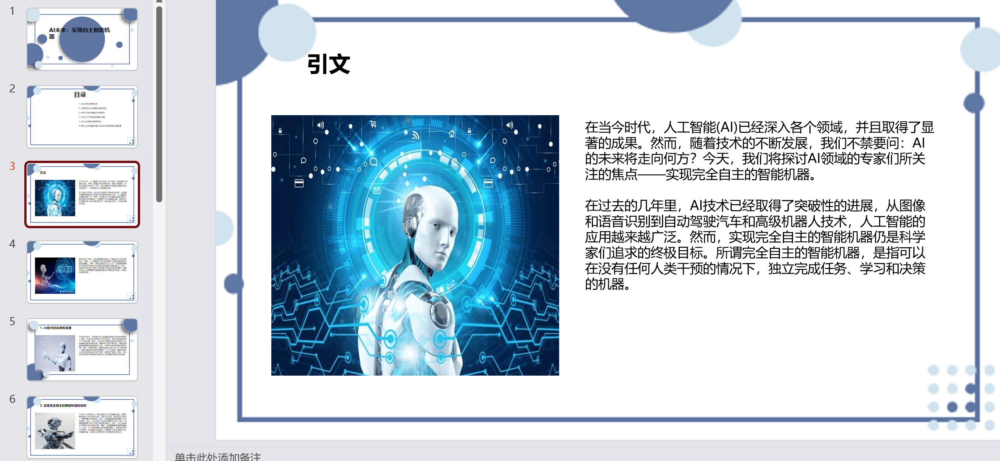
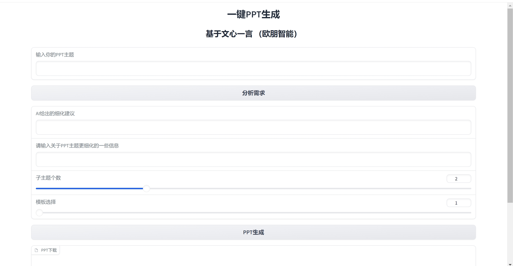

# <p align="center">YiYan-PPT</p>

<p align="center"><i>
基于文心一言的一键生成PPT，操作简单，提供gradio一键界面和一键可执行的py文件


## 🔥 效果展示
> 
> 详情请看./myppt/ 文件夹下的pptx，这个文件夹是专门用来存放生成的PPT的。

## 🎞️ 项目介绍 

> 一键生成PPT，基于用户的任务名称生成PPT文字大纲，将文字大纲解析成树的结构，再对该树进行深度遍历搜索，逐一生成对应幻灯片。

> 本项目主要是基于https://github.com/limaoyi1/Auto-PPT ， 文本解析成树结构和基于树结构生成PPT的相关代码在./mdtree文件夹下，在此表示感谢！

> 本项目完全由百度文心一言提供API支持，充分利用了文心一言API在国内生成速度快，效果优秀的优势。

>  PPT涉及的图像来源是通过百度图像搜索爬取的。

## ⭐ 一键使用



> 我使用的python版本是3.10,然后主要依赖包在requirements.txt。

> pip install -r requirements.txt

> 请在config.py配置好自己的API_Key和Secret_Key，若不会请参考[获取access_token](https://cloud.baidu.com/doc/WENXINWORKSHOP/s/Ilkkrb0i5)。

> gradio界面请一键运行gradio_test.py,就是想一键运行的可以直接运行test.py。


## 🧲 项目优势

> 🌟 简单的输入标题，一键生成PPT。同时你也可以通过AI的反问，给任务添加一些补充信息。

> 🎩 国内LLM API还得看百度，使用ernie-bot。

> 💡 层次化生成文字大纲，支持子主题个数的控制，这部分代码详见[structure_article.py](./structure_article.py).清晰明了。

> 🖼️ 核心关于基于树结构生成PPT代码在[./mdtree/tree2ppt.py](./mdtree/tree2ppt.py)。

> 🔒 代码结构清晰简单，很好理解，后续将放置讲解的PDF在项目中。

## 💡相关文件介绍 以及 一些改进介绍

> ./mdtree/tree2ppt.py 是最关键的将文本大纲（Markdown格式）转变为具体的PPT的PY文件，我主要将PPT首页幻灯片进行单独生成，同时为了防止某个子主题（或子孙主题）下的正文内容太长，我贴心的进行了正文分段处理，放在2页（或者多页）幻灯片进行展示。
```python
#./mdtree/tree2ppt.py 
            content_list = heading.source.split("\n\n")#heading.source即为正文部分
            content_max_word_num = 250
            begin_index = 0
            input_text_list = []
            while begin_index < len(content_list):
                # print("begin_index", begin_index, "所有元素个数", len(ele_text_list))
                input_token_i = 0
                input_text = ""
                for i in range(begin_index, len(content_list)):
                    if len(content_list[i]) + input_token_i < content_max_word_num:
                        input_text += "\n"+content_list[i]
                        input_token_i += len(content_list[i])
                        begin_index = i
                    else:
                        if input_token_i==0:#防止某一段长度直接大于正文最大长度，就被跳过了。
                            input_text +=content_list[i]
                        break
                begin_index += 1
                input_text_list.append(input_text)

            for content_i in range(len(input_text_list)):
                if content_i==0:
                    if self.theme_param["main_page"].get("img_info") and len(self.img_dicts)>0:
                        img_dict = self.img_dicts[random.randint(0, len(self.img_dicts) - 1)]
                    else:
                        img_dict = {}
                    MD2Slide(self.prs, self.theme, heading.text, img_dict=img_dict,content=input_text_list[content_i].strip())
                else:
                    if self.theme_param["main_page"].get("img_info") and len(self.img_dicts)>0:
                        img_dict = self.img_dicts[random.randint(0, len(self.img_dicts) - 1)]
                    else:
                        img_dict = {}
                    MD2Slide(self.prs, self.theme, "", img_dict=img_dict,content=input_text_list[content_i].strip())
```

> ./mdtree/img_search.py 是基于百度的图片爬取代码

> ppt模板是在./my_ppt_mode文件夹下，提供2份模板，./my_ppt_mode/1 是有文图的， ./my_ppt_mode/2 是纯文字的模板，

> 以./my_ppt_mode/1的文件夹目录下文件举例，title.png是指PPT首页的图像，详细关于PPT模板的详细参数保存在mode.json中，主要分成slide_size（设置PPT每页幻灯片的长宽尺寸），first_page（首页的信息），catalog_page（目录页的信息，目录页的正文部分直接参考main_page），main_page(正文部分) 四大部分，如果main_page中没有img_info，则指该模板不带图片纯文字。

> img/ 文件夹为PPT非首页的背景图片，每张幻灯片随机抽取其中一张。

## 🌟 Star History


[](https://star-history.com/#hl123-123/Yiyan-PPT&Timeline)


